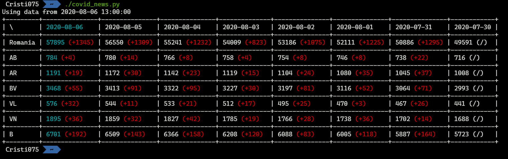

# COVID-19 News (RO)
See latest data about the COVID-19 pandemic in Romania in your terminal.


# How to use?
## Prerequisites
You must have Python3 and pip installed in order to use this.
## Installation
- Clone this repository
- Install the python dependencies using pip
- Run the python script  
(Optional) Edit watched_counties from the script to see only the regions that you are interested in

```shell script
git clone https://github.com/Cristi075/covid19_news_RO.git
cd covid19_news_RO
pip install -r requirements.txt
python3 covid_news.py
```

# Acknowledgements

This script is using data from https://datelazi.ro/, the official site that publishes data related to the pandemic in Romania.